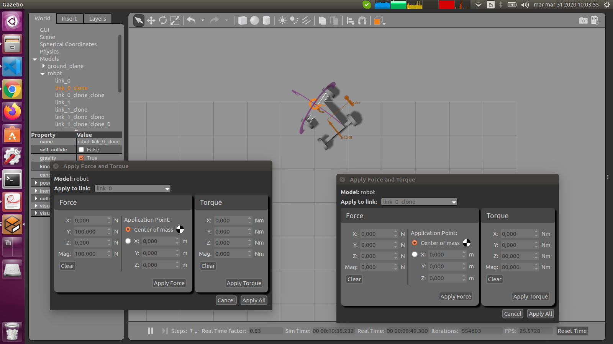
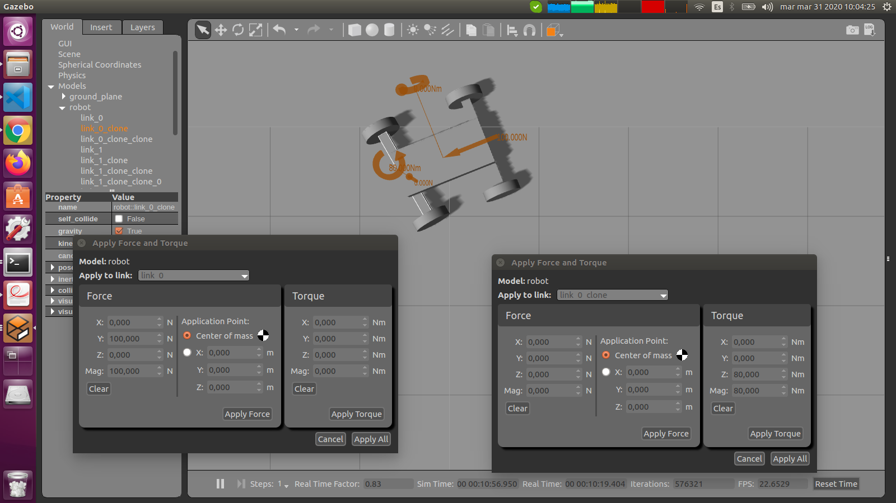
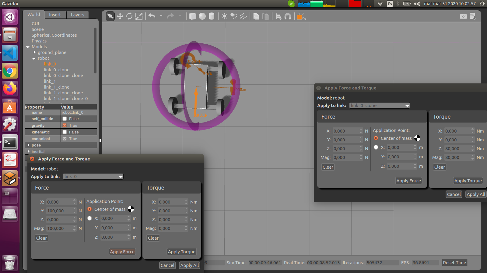
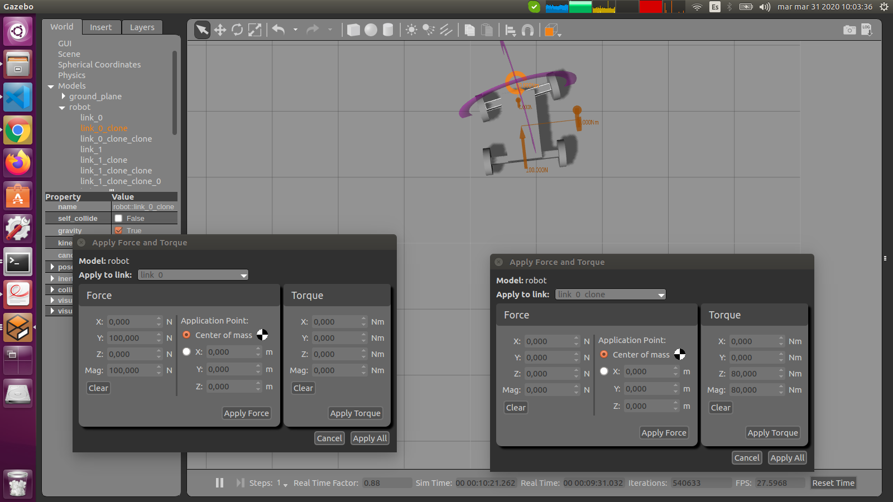
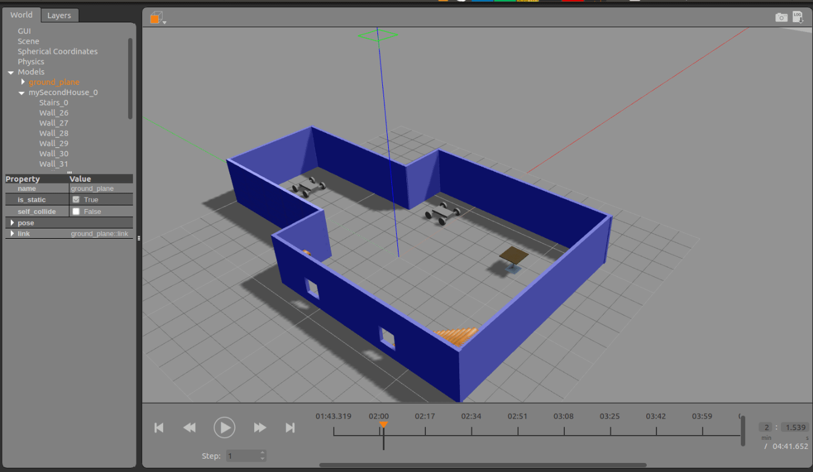

# gazebo-basics
## Project specification

**Build My World**

A basic world in gazebo... 

Common structure of a gazebo environment:

  `model` :  where there are two models created: a four wheel mobile robot and an closed indoor environment, 

  `script`:  that contains a script that is executed when the world is loaded in gazebo,

  `world` :  here is the gazebo world file that contains two copies of my mobile robot inside an ugly house :) 

  `logs`  :  sequence of forces and torques recorded manually that could be play back at any time further using: 

        gazebo -u -p logs/test-robots/state.log
  
# Playing with forces and torques
  
 

 

 

 

**Animation with forces on the robots**

 

*Here you can find several good material to learn gazebo in depth: http://gazebosim.org/tutorials*